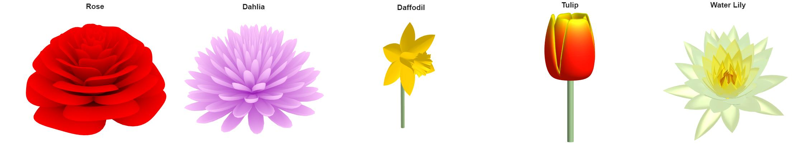

# Digital Art with MATLAB

This is a repository to share interesting bits of art created with MATLAB.

See the README in each directory for how to use each of the examples.

- pumpkin - Draw a pumpkin
- flowers - Draw some flowers
- snowflake - Draw snowflakes
- parallax - Draw two images hidden behind eachother in 3d

