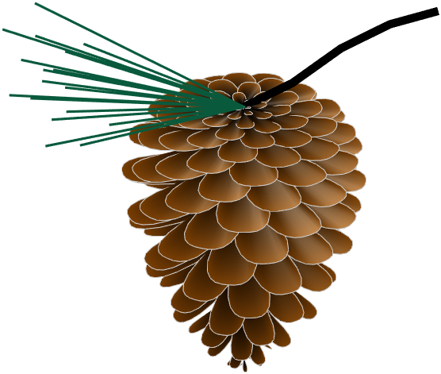
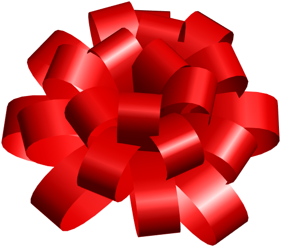
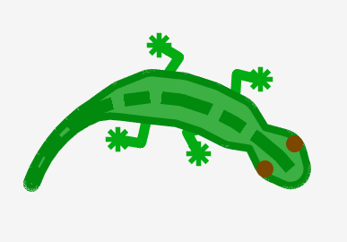
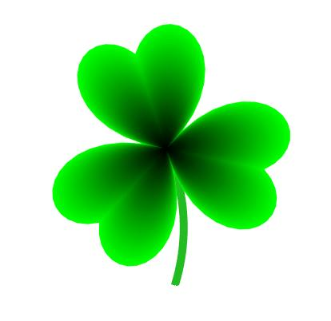
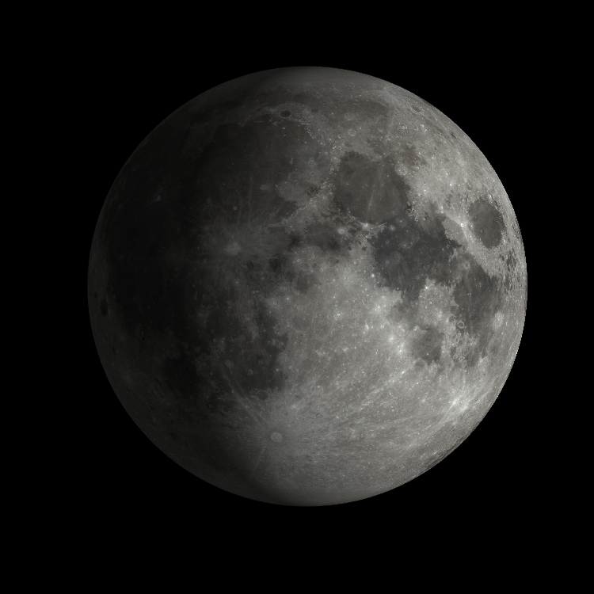

# Digital Art with MATLAB

This is a repository to share interesting bits of art created with MATLAB.

See the README in each directory for how to use each of the examples.

- cookie - Draw shaped cookies
- creatures - Draw a lizard that chases the mouse
- emoji - Scatter plot with emoji
- flowers - Draw some flowers
- giftwrap - Draw a bow for your gift
- may4th - Draw may 4th themed images
- parallax - Draw two images hidden behind eachother in 3d
- pinecone - Draw a pinecone
- pipie - Draw a pie with a pi on it
- plants - Draw some plants
- pumpkin - Draw a pumpkin
- ring - Draw a gold ring with inscription
- snake - Draw an animated snake folding toy
- snowflake - Draw snowflakes
- solarsystem - Draw the moon and its phases

Sample Nature images:

Sample objects and holiday doodles:

Fun Illusions:

