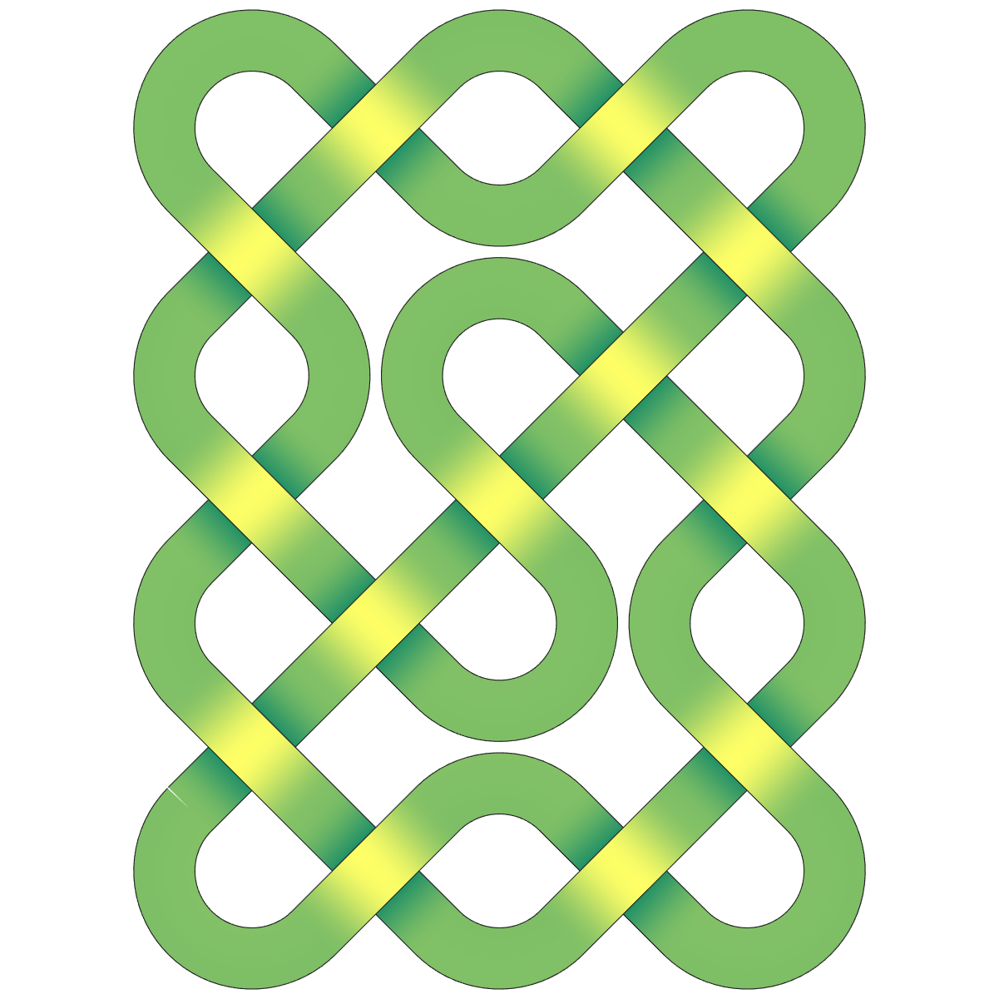

# Celtic Knotwork

A script that lets you create a char pattern to draw celtic knots.

- `celticknot` -> Draw a celtic knot as a ribbon
- `celticknotdraw` -> Draw a celtic knot with the arrow keys

Using `celticknot`, this pattern draws this knot:
```
PAT='-|-|-))|(-))|(-)|-)|-)|-))|((-|(-|(-|(-)|((-)|((';
```


The pattern characters have these meanings:
- `(` : turn right
- `)` : turn left
- `-` : Straight line under
- `|` : Stright line over
