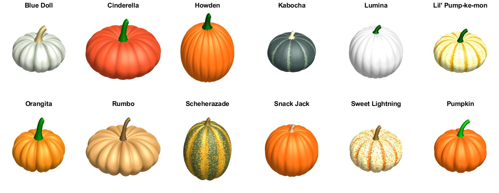

# Pumpkin

Code for drawing a Pumpkin wrapped up as an object so you can experiment with the parameters.
It supports displaying different pumpkin breeds by manipulating the different parameters.

- Pumpkin.m - Paramaterized pumpkin object for experimenting with the inputs.
- setPumpkinBreed.m - Configure Pumpkin parameters to be different breeds
- pumpkin_tiles.m - Draw all the pumpkins in a tiled layout (see below)
- short_punkin.m - Just the essentials for drawing a punkin.
- punkin280.m - Draw a simple pumpkin in 280 chars or less.

