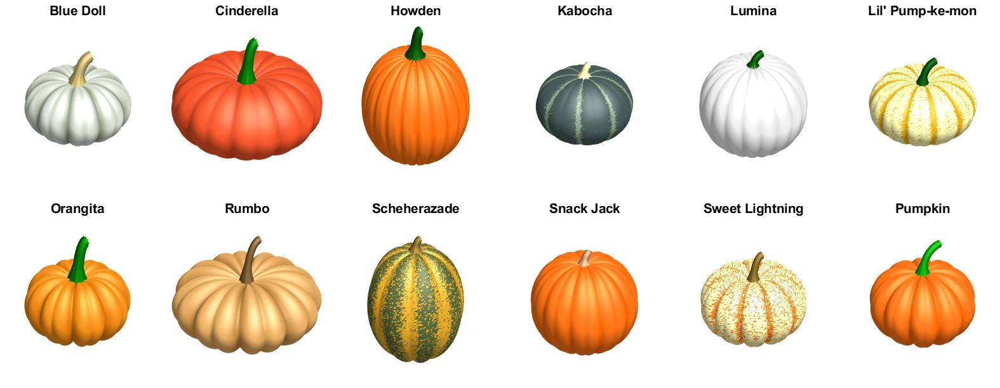
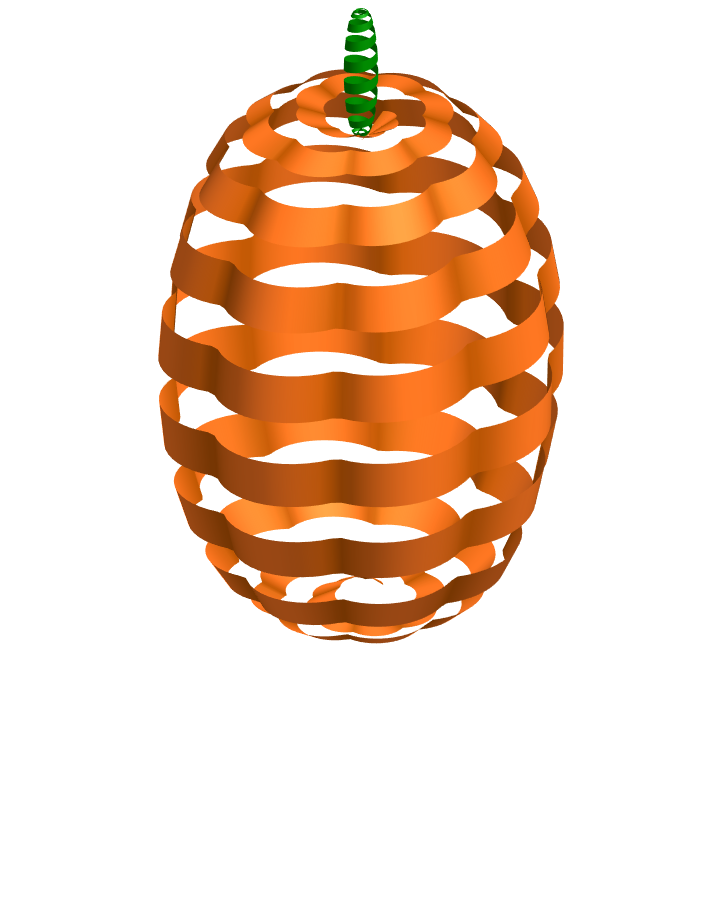

# Pumpkin

Code for drawing Pumpkins.

- Pumpkin.m - Paramaterized pumpkin object for experimenting with the inputs.
- setPumpkinBreed.m - Configure Pumpkin parameters to be different breeds
- pumpkin_tiles.m - Draw all the pumpkins in a tiled layout (see below)
- short_punkin.m - Just the essentials for drawing a punkin.
- punkin280.m - Draw a simple pumpkin in 280 chars or less.
- pumspring.m - Animate a pumpkin spring
- pumpkinmoon.m - Draw the moon on a pumpkin and show phases of the moon.
- sleepyhollow_eigenwalker - Eigenwalker with a pumpkin head.

