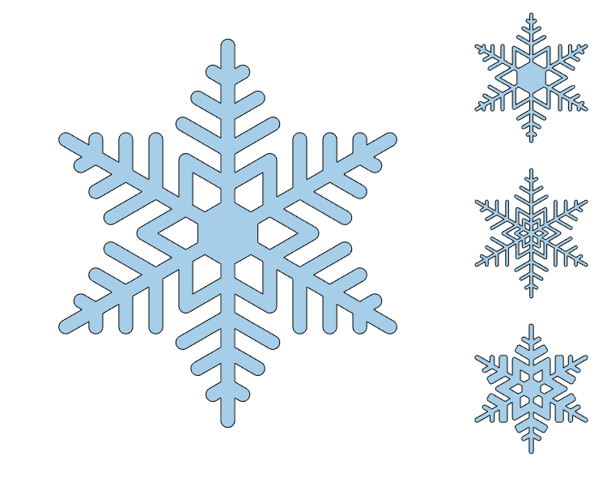

# Snowflake

Code for drawing a snowflake based on a vector of steps.
The steps represent how far the snowflake will grow at each step before making
a transition from growing the nucleus, or before growing spurs.

- snowflake.m - Simple function for drawing a 2d snowflake.
- snowflakescript.m - Same as the function, but written as a script.
- snowflake3d.m - Extrude the 2d snowflake into 3d using a triangulation.
- snowtiles - Draw different snowflakes in a tiled layout (see image below)

